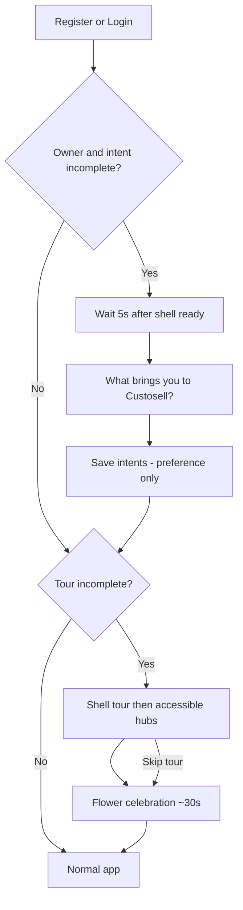

# Intent selection + app-wide product tour

International onboarding for Custosell as a **business operating system**.  
ADR: [../adr/2026-07-11-intent-and-app-tour.md](../adr/2026-07-11-intent-and-app-tour.md)

## Principles

- **Intent ≠ permissions.** Owners pick modules in Module access. Intent never flips staff or owner module checkboxes.
- **Tour ≠ unlock.** Tour only highlights what the signed-in user can already open.
- **Global tone.** “Run your business” — competitive with international suites; local compliance lives inside modules.

## Flow



**Timing:** Intent modal waits **5 seconds** after login/register when online (once `needs_intent` is known). Offline skips that delay. Celebration runs **once for ~30 seconds**. Tour Replay applies **locally first** so the tour opens immediately; API sync is background. **Tour works offline** using embedded `user.onboarding`.

**Auto Play (product):** Opt-in, **not** on by default. Recommended dwell **4–5s per step** after the spotlight is ready (current: 5s).

## Intent cards (v1 copy)

Pick **one primary**; optional **one secondary**. Cards mirror Custosell modules (icons/tones match Apps launcher): Dashboard, Sales, Inventory, Customers, Pipeline, Projects & Estimates, Expenses, Documents, HR, Accounting, Forecasting, plus “Show me everything”.

**After submit (owner):** soft line — modules stay under Settings → Module access.  
**Skip:** still continues into the guided tour.

## Shell + module tour (v1)

Targets need stable anchors (`data-tour`). Guide card sits beside the spotlight with a **caret that points at the target**, reflowing on resize / orientation / `visualViewport` (phone, tablet, desktop).

| Area | What’s covered |
|------|----------------|
| Shell | Apps, network, Guide/Tour, profile, sidebar, Quick Support |
| Modules | One step per accessible module — **Account, Discover & My Orders, and Custosell Guide included** |
| Discover | Sidebar spotlight only — **does not navigate** to `/discover` (immersive shell would leave tour targets) |
| Grouping | Each module expands so **header + sub-nav** share one spotlight (not a step per link) |
| Owners | Module access in Settings |
| Finish / Skip | Flower celebration (~30s) + congratulations; skip has its own welcome copy |
| Icons | Tour cards use the same module icons/tones as the Apps launcher |
| Precision | Instant scroll + stable re-measure; group wrappers for expanded sections |
| Sidebar | Large screens **expand** when the target is in the sidebar; phones open the drawer |

## Wireframe (intent)

```
┌─────────────────────────────────────────────┐
│  What brings you to Custosell?              │
│  Choose what matters most. You can change   │
│  modules anytime in settings.               │
│                                             │
│  ┌──────────┐ ┌──────────┐ ┌──────────┐   │
│  │ Sell     │ │ Get paid │ │ Buy &    │   │
│  │ every day│ │          │ │ supply   │   │
│  └──────────┘ └──────────┘ └──────────┘   │
│  ┌──────────┐ ┌──────────┐ ┌──────────┐   │
│  │ Win deals│ │ Projects │ │ People   │   │
│  └──────────┘ └──────────┘ └──────────┘   │
│  ┌──────────┐ ┌──────────┐                 │
│  │ Numbers  │ │ Explore  │                 │
│  └──────────┘ └──────────┘                 │
│                                             │
│  [ Continue ]          Skip for now         │
└─────────────────────────────────────────────┘
```

## Wireframe (tour spotlight)

```
┌─ Navbar ── [Apps*] [Guide] [Network] ───────┐
│         ┌─────────────────────┐             │
│         │ Step 1 of 8         │             │
│         │ Apps launcher       │             │
│         │ Jump between areas… │             │
│         │ [Back] [Next] [Skip]│             │
│         └─────────────────────┘             │
├ Sidebar* ─┤  Main                           │
│ Dashboard │                                 │
│ Sales     │                                 │
│ …         │                                 │
└───────────┴─────────────────────────────────┘
```

## Data (proposed)

| Field | Where | Notes |
|-------|--------|--------|
| `primary_intent` | business or owner profile | enum id |
| `secondary_intent` | same | nullable |
| `intent_completed_at` / `intent_skipped_at` | same | gate login |
| `tour_completed_at` / `tour_skipped_at` | **user** | per-user |
| `tour_step` | user | resume |

## Implementation map (shipped)

| Layer | Location |
|-------|----------|
| Migration | `2026_07_11_233000_add_onboarding_intent_and_tour_fields.php` |
| Service | `App\Services\OnboardingService` |
| API | `GET/PATCH /auth/onboarding` |
| FE gate | `modules/onboarding/OnboardingGate.tsx` |
| Intent UI | `IntentOnboardingModal.tsx` |
| Tour | `ProductTour.tsx` + `productTourSteps.ts` |
| Replay | Navbar **Tour** button (`GuideHeaderNav`) |

## Success metrics

- Intent completion rate  
- Tour completion / skip rate  
- Time to first meaningful action **by primary intent** (only where module enabled)  
- Module expansion (owner enables more modules within 7 / 30 days)
