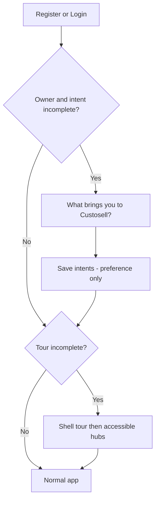

# Intent selection + app-wide product tour

International onboarding for Custosell as a **business operating system**.  
ADR: [../adr/2026-07-11-intent-and-app-tour.md](../adr/2026-07-11-intent-and-app-tour.md)

## Principles

- **Intent ≠ permissions.** Owners pick modules in Module access. Intent never flips staff or owner module checkboxes.
- **Tour ≠ unlock.** Tour only highlights what the signed-in user can already open.
- **Global tone.** “Run your business” — competitive with international suites; local compliance lives inside modules.

## Flow



## Intent cards (v1 copy)

Pick **one primary**; optional **one secondary**.

| ID | Title | Supporting line |
|----|--------|-----------------|
| `sell_pos` | Sell every day | Counter sales, stock, and shifts — including offline |
| `get_paid` | Get paid | Customers, invoices, and payment receipts |
| `buy_supply` | Buy and supply | Marketplace, purchase orders, supplier invoices |
| `win_deals` | Win deals | Pipeline boards, leads, and follow-ups |
| `run_projects` | Run projects | Estimates, project boards, and delivery |
| `people_payroll` | People and payroll | Team, attendance, leave, and payroll |
| `know_numbers` | Know the numbers | Books, statements, and forecasting |
| `explore` | Not sure yet | Show me around — I’ll choose as I go |

**After submit (owner):** soft line — “You can turn modules on anytime in Settings → Module access.”  
**Home CTA (soft):** suggest a first action matching primary intent if that module is already enabled; otherwise point to Module access or Dashboard.

## Shell tour step map (v1)

Targets need stable anchors (e.g. `data-tour="navbar-apps"`).

| Step | Target | Message |
|------|--------|---------|
| 1 | Apps launcher (navbar) | Jump between areas of your business from one place |
| 2 | Network / status (navbar) | See online, slow, or offline — core work keeps going when the network drops |
| 3 | Guide (navbar) | Tutorials, FAQs, and help when you need them |
| 4 | Sidebar | Your modules live here — only what your business has enabled |
| 5 | Sidebar group (first accessible) | Open a section to reach day-to-day screens |
| 6 | Module launcher reminder | Prefer the grid? Use Apps anytime |
| 7 | Dashboard or first accessible hub | You’re ready — start with this workspace |
| 8 | Module access (owners only) | Turn modules on or off for your team here |

Skip if target missing (e.g. no Guide access). Offline: skip steps that only apply to online-only modules.

## Wireframe (intent)

```
┌─────────────────────────────────────────────┐
│  What brings you to Custosell?              │
│  Choose what matters most. You can change   │
│  modules anytime in settings.               │
│                                             │
│  ┌──────────┐ ┌──────────┐ ┌──────────┐   │
│  │ Sell     │ │ Get paid │ │ Buy &    │   │
│  │ every day│ │          │ │ supply   │   │
│  └──────────┘ └──────────┘ └──────────┘   │
│  ┌──────────┐ ┌──────────┐ ┌──────────┐   │
│  │ Win deals│ │ Projects │ │ People   │   │
│  └──────────┘ └──────────┘ └──────────┘   │
│  ┌──────────┐ ┌──────────┐                 │
│  │ Numbers  │ │ Explore  │                 │
│  └──────────┘ └──────────┘                 │
│                                             │
│  [ Continue ]          Skip for now         │
└─────────────────────────────────────────────┘
```

## Wireframe (tour spotlight)

```
┌─ Navbar ── [Apps*] [Guide] [Network] ───────┐
│         ┌─────────────────────┐             │
│         │ Step 1 of 8         │             │
│         │ Apps launcher       │             │
│         │ Jump between areas… │             │
│         │ [Back] [Next] [Skip]│             │
│         └─────────────────────┘             │
├ Sidebar* ─┤  Main                           │
│ Dashboard │                                 │
│ Sales     │                                 │
│ …         │                                 │
└───────────┴─────────────────────────────────┘
```

## Data (proposed)

| Field | Where | Notes |
|-------|--------|--------|
| `primary_intent` | business or owner profile | enum id |
| `secondary_intent` | same | nullable |
| `intent_completed_at` / `intent_skipped_at` | same | gate login |
| `tour_completed_at` / `tour_skipped_at` | **user** | per-user |
| `tour_step` | user | resume |

## Implementation map (shipped)

| Layer | Location |
|-------|----------|
| Migration | `2026_07_11_233000_add_onboarding_intent_and_tour_fields.php` |
| Service | `App\Services\OnboardingService` |
| API | `GET/PATCH /auth/onboarding` |
| FE gate | `modules/onboarding/OnboardingGate.tsx` |
| Intent UI | `IntentOnboardingModal.tsx` |
| Tour | `ProductTour.tsx` + `productTourSteps.ts` |
| Replay | Navbar **Tour** button (`GuideHeaderNav`) |

## Success metrics

- Intent completion rate  
- Tour completion / skip rate  
- Time to first meaningful action **by primary intent** (only where module enabled)  
- Module expansion (owner enables more modules within 7 / 30 days)
